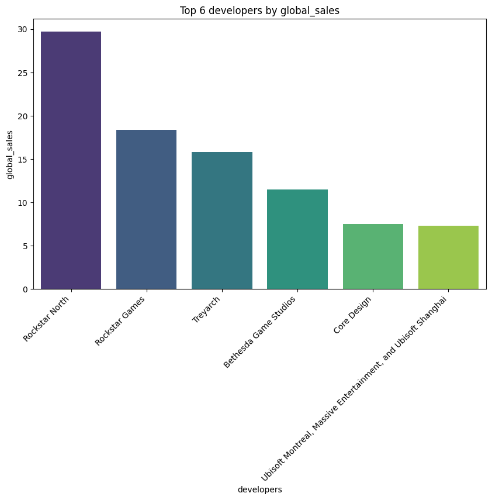
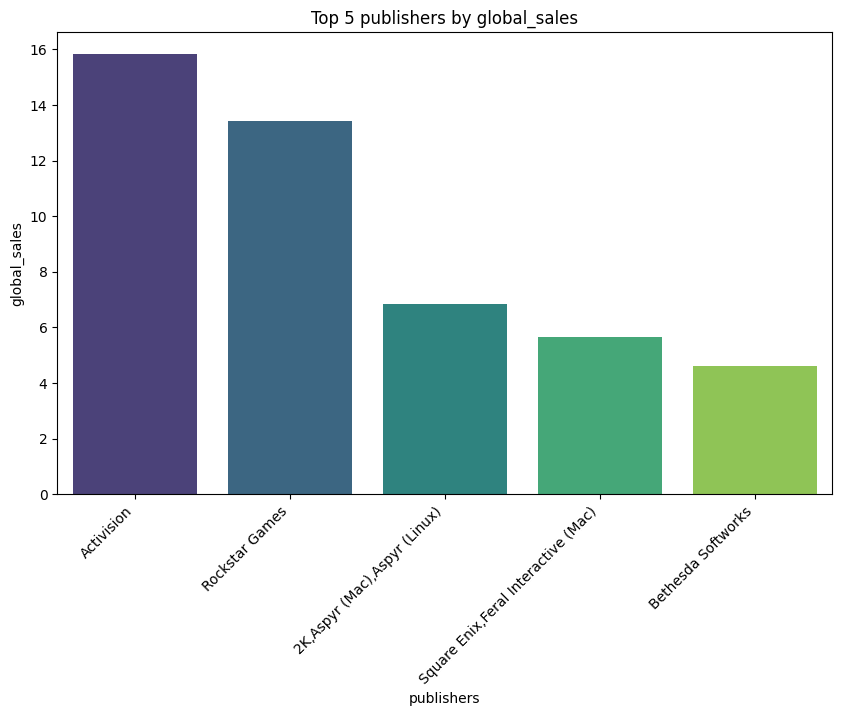
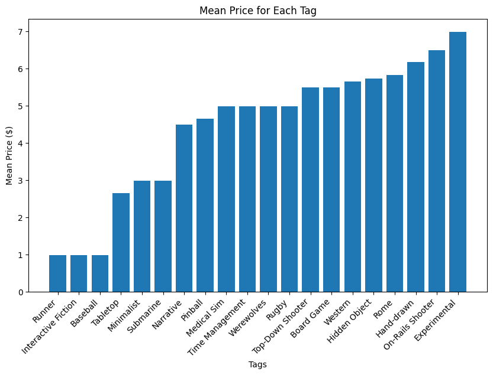

README - Steam Project
=================

A project for analyzing the relationship between sales and ratings for games sold on the Steam platform.

Documentation
-------------

For documentation, please visit `ReadTheDocs: Steam Project <https://jbhiltscher.github.io/steam_project/>`_.

Installation and updating
-------------------------

Use the package manager `pip` to install steam_project. Rerun this command to check for and install updates. Installation should take no more than 5 minutes. The package requires `python>=3.7`.

.. code-block:: bash

    pip install git+https://github.com/jbhiltscher/steam_project.git

Quick Demo
----------

Below is a quick demo of how to load in data using the package:

.. code-block:: python
    import pandas as pd
    import numpy as np
    from scipy.stats import pearsonr
    from scipy.stats import pointbiserialr
    import matplotlib.pyplot as plt
    import seaborn as sns
    import pkg_resources
    from SteamInsights import load_data
    #from rfphate import RFPHATE
    #from load_data import *

    # For all games dataset
    all_games = load_data()

    # For tags dataset
    tags = load_data('tags')

    # For ratings dataset
    ratings = load_data('ratings')

We can visually explore the top values for a category by global sales, ratings, and price. 

By developers:

.. code-block:: python

    top_n_values(column='developers', criteria='global_sales', top_n=6, plot=True)

By producers:

.. code-block:: python

    top_n_values(column='publishers', criteria='global_sales', top_n=6, plot=True)

We can also look at the top combinations of tags:

.. code-block:: python

    tags_related(5, True)

