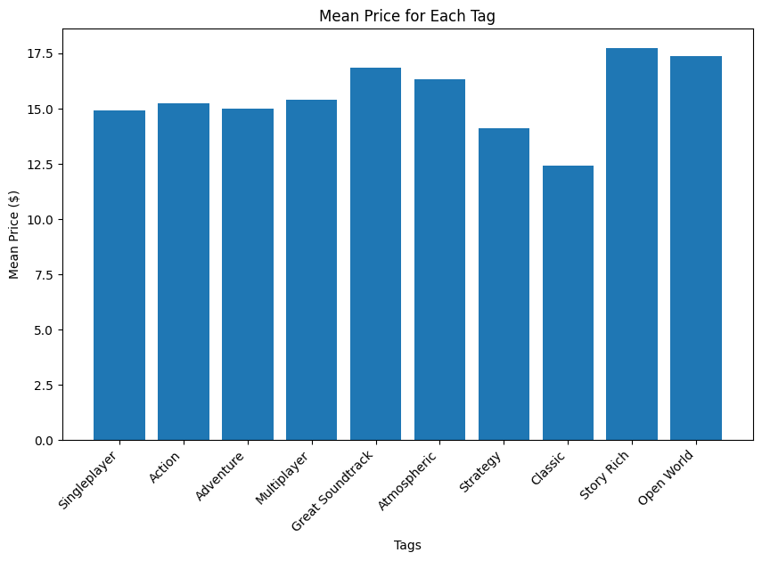

README - Steam Project
=================

This is a package for cleaning and analyzing data about PC games sold on the Steam Store. It has code for data cleaning and functions for analyzing metrics like price, sales, review data, and game genre. In order to run the cleaning script, a user must first download the dataset found here (https://drive.google.com/file/d/1k8bwceinqaT0Dhv_PfqPhhRuRpeJ4aZI/view?usp=sharing) and store it as ‘data/games.csv’ because it is too large for storing on Github.

Documentation
-------------

For documentation, please visit `ReadTheDocs: Steam Project <https://jbhiltscher.github.io/steam_project/>`_.

Installation and updating
-------------------------

Use the package manager `pip` to install steam_project. Rerun this command to check for and install updates. Installation should take no more than 5 minutes. The package requires `python>=3.7` but not greater than 3.11.

.. code-block:: bash

    pip install git+https://github.com/jbhiltscher/steam_project.git

Quick Demo
----------

Below is a quick demo of how to load in data using the package:

.. code-block:: python

    import pandas as pd
    import numpy as np
    from scipy.stats import pearsonr
    from scipy.stats import pointbiserialr
    import matplotlib.pyplot as plt
    import seaborn as sns
    import pkg_resources
    from SteamInsights.load_data import load_data

    all_games = load_data('all_games')
    tags = load_data('tags')
    ratings = load_data('ratings')

In order to obtain a game recommendation, we can run the following function with the desired metrics:

.. code-block:: python

    from SteamInsights.analytic_functions import recommend
    recommend(num_games=5,price_max=20, tags_to_filter=['Action'], reviews="Positive")

We can visually explore the top values for a category by global sales, ratings, and price.

By developers:

.. code-block:: python

    from SteamInsights.analytic_functions import top_n_values
    top_n_values(column='developers', criteria='global_sales', top_n=6, plot=True)

.. image:: figures/top_n_values_developers.png

By producers:

.. code-block:: python

    from SteamInsights.analytic_functions import top_n_values
    top_n_values(column='publishers', criteria='global_sales', top_n=6, plot=True)

.. image:: figures/top_n_values_publishers.png

We can also look at the mean price of games with the top 10 most common tags.

.. code-block:: python

    from SteamInsights.analytic_functions import graph_mean_tag_prices
    graph_mean_tag_prices(which='common', num=10)

Citations
-------------
Here are the citations for the 5 Kaggle datasets that we used in this project:

Martin Bustos Roman. (2022). Steam Games Dataset. https://www.kaggle.com/datasets/fronkongames/steam-games-dataset

Aleksandr Antonov. (2022, January). Steam Games Complete Dataset, Version 1. https://www.kaggle.com/datasets/trolukovich/steam-games-complete-dataset

Rush Kirubi. (2016). Video Game Sales with Ratings. https://www.kaggle.com/datasets/rush4ratio/video-game-sales-with-ratings

Kendall Gillies. (2017). Video Game Sales and Ratings. https://www.kaggle.com/datasets/kendallgillies/video-game-sales-and-ratings

Mohammed Alhamad. (2020). Video Games Rating by ESRB, Version not available. https://www.kaggle.com/datasets/imohtn/video-games-rating-by-esrb?select=Video_games_esrb_rating.csv

(This last citation was a Kaggle dataset that was included in the project but we didn't end up using.)

